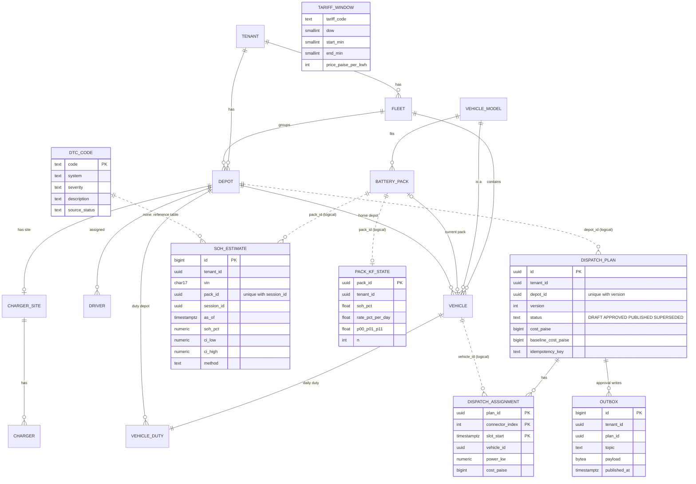

# Entity-relationship diagram (as built)

Source of truth: the migrations `services/fleet-api/migrations/0001_fleet_core.sql`, `services/battery-intel/migrations/0001_battery_core.sql`,
`services/dispatch-optimizer/migrations/0001_dispatch_core.sql`. One Postgres cluster, one schema per owning service. **Solid lines are
foreign keys. Dotted lines are logical references across schemas: a service never reads another service's schema (it uses the API or
events), so no cross-schema foreign key exists by design.**

(The last line is only there to keep `DTC_CODE` in the picture; the DTC catalogue is a stand-alone reference table, joined in
code by code string, not by foreign key.)

Column lists for the fleet tables are abbreviated in the diagram; the migration has all columns (coordinates, capacities, connector
types, required SoC and so on). Planned but not built tables from CLAUDE.md §5.2: `app_user`, `role`, `user_role`, `subscription`,
`vehicle_dtc_event`, `charging_session`, `alert`, `alert_ack`, `audit_log`, `erasure_request`, `runbook_chunk`, `fault_signature`.

## Normal form and deliberate denormalisation

The fleet core is 3NF: every non-key column depends on the key of its own table (vehicle model attributes live on `vehicle_model`, not on
`vehicle`; a charger's site on `charger`, not repeated per vehicle; a pack's model on `battery_pack`).

Deliberate departures, each with its reason:

| Where | Denormalisation | Why |
|---|---|---|
| Every tenant-owned table | `tenant_id` repeated on child rows (e.g. `soh_estimate`, `dispatch_assignment`, `charger`) | Row-Level Security policies need `tenant_id` on the row itself; a join in the policy would be slower and easier to get wrong. |
| `battery.pack_kf_state` | Cached Kalman state per pack (derived from the estimate history) | Each new session updates SoH in O(1) under one row lock instead of replaying history; it is changed only in the same transaction that inserts the estimate. |
| `dispatch.dispatch_plan` | `cost_paise`, `energy_cost_paise`, `degradation_cost_paise`, baseline totals stored (derivable from assignments) | The console reads a plan without re-summing hundreds of assignment rows; tests assert `energy_cost_paise` equals the sum of assignment costs exactly. |
| `battery.soh_estimate` | `vin` stored next to `pack_id` | The API answers by VIN, and a vehicle's pack can change; the row keeps the VIN it was estimated for (see the pack-swap handling in `soh_report`). |
| `fleet.vehicle_duty` | `depot_id` as well as `vehicle.home_depot_id` | The duty schedule is per depot stay and may differ from the home depot; it is the optimiser's departure constraint. |

Not built (listed in CLAUDE.md, absent here): `vehicle.latest_soh_pct` cache and the `mv_fleet_battery_summary` materialised view. The
fleet summary query computes the latest estimate per pack on the fly with `DISTINCT ON`.
